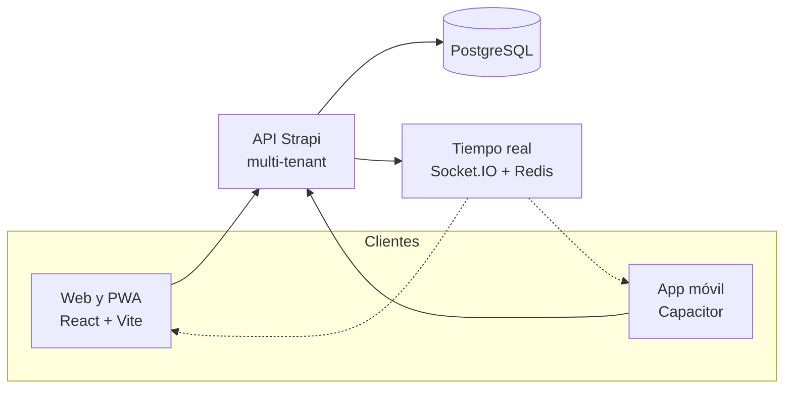

# KINVO

**Suite SaaS multi-tenant para empresas: cada área del negocio conectada al mismo núcleo.**

> Este repositorio es la vitrina pública del producto. El código fuente es privado.

## Qué es KINVO

KINVO es la suite SaaS que desarrollé y ofrezco como servicio desde [ALCORE](https://alcore-gt.com/). Cada empresa trabaja en su propio espacio (multi-tenant) y activa solo los módulos que necesita.

## Módulos

| Módulo | Qué resuelve |
|---|---|
| CRM | Relación con clientes y seguimiento comercial |
| Comercial | Ventas en 4 canales sobre el mismo motor de inventario |
| CMS | Contenido y landing pages |
| Panel financiero | Datos del negocio en vivo |
| Recursos humanos | Verificación facial y marcaje biométrico |
| Encuestas | Captura de datos |
| Envíos | Rastreo GPS y monitoreo en tiempo real |
| Correo empresarial | Email corporativo |
| ChatAgent | Agente de IA para atención y agenda |
| Administración | Control de acceso por roles |

### Canales de venta del módulo Comercial

- **Mostrador:** punto de venta.
- **Restaurante:** servicio a mesa.
- **Caja:** donde cierran todas las ventas.
- **Tienda en línea:** catálogo público y pedidos.

## Arquitectura

## Stack

- **Frontend:** React, TypeScript, Vite, Tailwind CSS, TanStack Query, PWA y Capacitor.
- **Backend:** Strapi, PostgreSQL, Redis y Socket.IO.

## ¿Quieres usar KINVO en tu empresa?

Escríbeme por [LinkedIn](https://www.linkedin.com/in/andrelopezgt/) o visita [alcore-gt.com](https://alcore-gt.com/).
